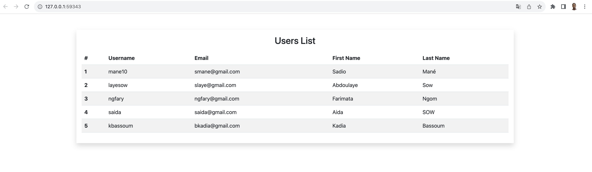
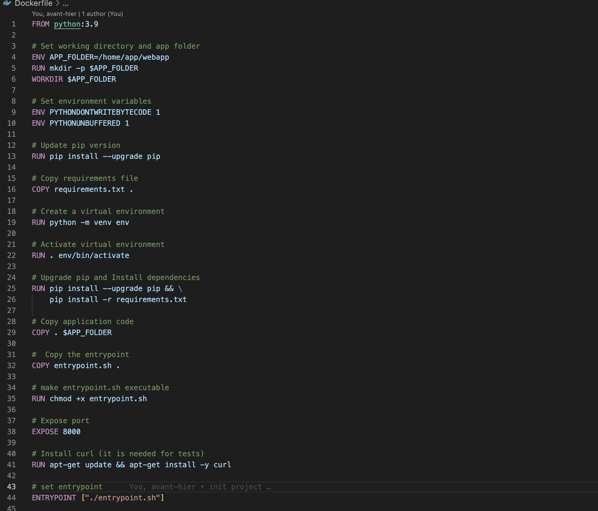
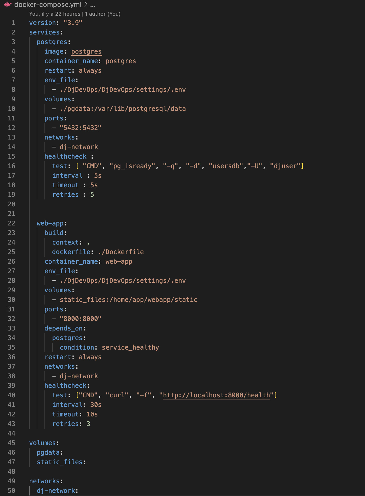
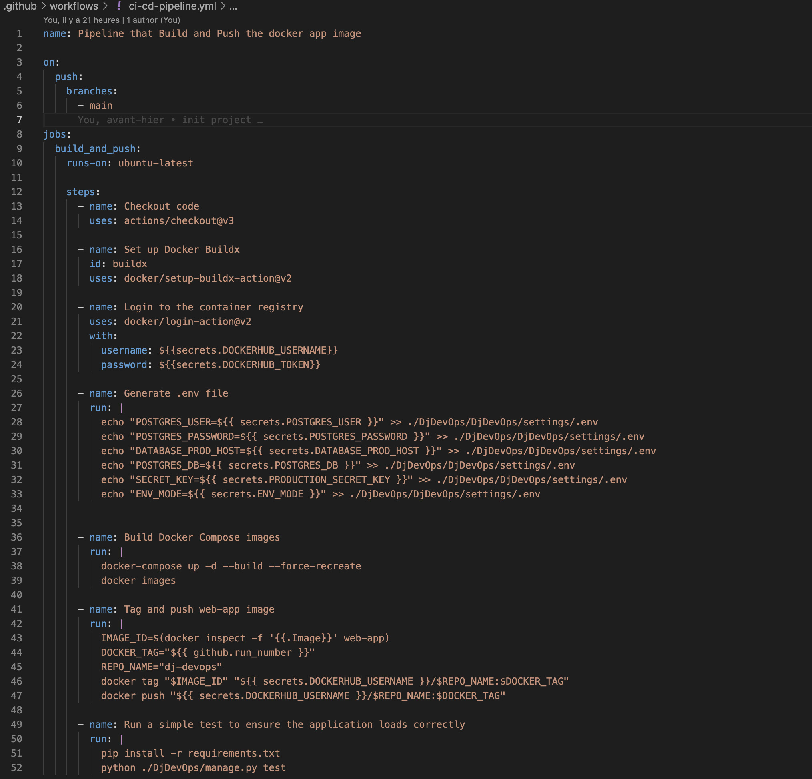
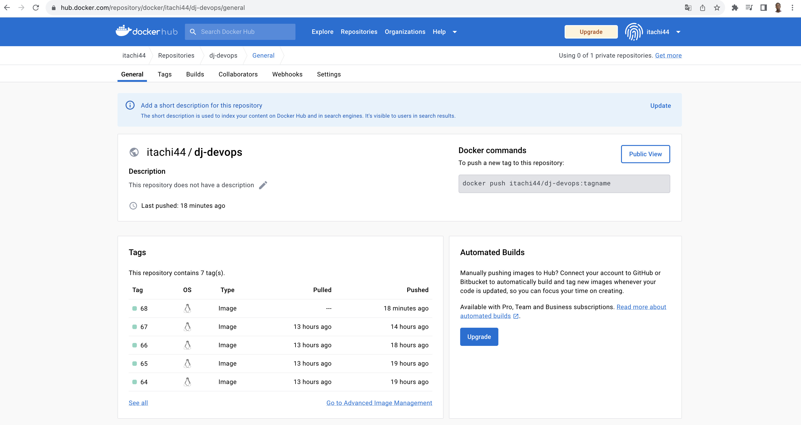
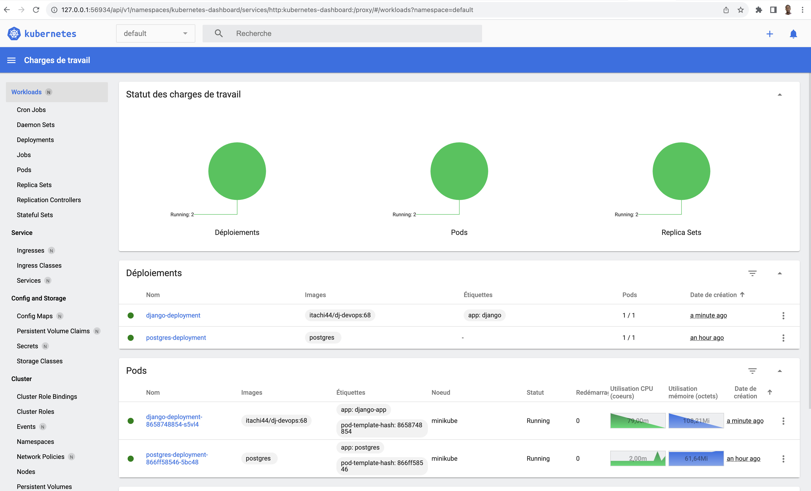

# DevOps Project with Django, Docker, GitHub Actions, and Kubernetes 

## Objective

Develop a simple Django application that is deployed using a Continuous Integration/Continuous Deployment (CI/CD) pipeline. The pipeline will be implemented using GitHub Actions, Docker, and Kubernetes.


## Members of the Team

- Cheikh Ahmadou Bamba DIOP
- Aida SOW

### Web Application Development:

It's a django application with a single view, which returns the list of users in the databases when accessed (username, email, first name and last name).




### Dockerization:

We have written a Dockerfile for the Django application and use Docker Compose to run the Django app and the Postgres DB in local development environment.






- The Dockerfile sets up the Python environment, installs dependencies, and prepares the Django application for execution.
- The Docker Compose file defines two services: one for PostgreSQL and one for the Django application.
- PostgreSQL is configured with data persistence and a healthcheck.
- The Django service builds from the Dockerfile, maps volumes for static files, and depends on PostgreSQL being healthy before starting.
- Healthchecks are in place to ensure both PostgreSQL and the Django application are running properly.
- Named volumes are used for data persistence and serving static files.
- A custom network connects the services, allowing them to communicate within the same network.

Overall, this setup provides a robust and reproducible environment for running the Django application and PostgreSQL database in a local development environment using Docker and Docker Compose.

### CI/CD Pipeline Setup:

we have implemented a GitHub Actions workflow. Whenever changes are pushed to the main branch, the workflow should perform the following actions:

- Build the Docker image for the Django application
- Run a simple test to ensure the application loads correctly.
- Push the Docker image to a container registry (such as Docker Hub)






### Kubernetes Deployment:

we have established a Kubernetes deployment configuration for both the Django application and the Postgres database service. This deployment is designed to create a Kubernetes Deployment and a Service, allowing us to expose the Django application on the internet. Due to resource constraints, we used Minikube for local Kubernetes development.


#### Prerequisites & Installation:

Before diving into the deployment, you need to ensure that Minikube is installed and properly configured. You can follow the installation instructions at Minikube Documentation (```https://minikube.sigs.k8s.io/docs/start/```). Additionally, we need to start Minikube, set up the Docker environment, open the Minikube dashboard, enable metrics-server, and apply secrets and deployment configurations.

Here's a brief summary of the deployment steps:

- Start Minikube: minikube start
- Set up the Docker environment: eval $(minikube docker-env)
- Open the Minikube dashboard (optional): minikube dashboard
- Enable metrics-server: minikube addons enable metrics-server
- Apply Django secrets: kubectl apply -f django-secrets.yaml
- Apply Postgres secrets: kubectl apply -f postgres-secrets.yaml
- Deploy the Postgres service: kubectl apply -f postgres-deployment.yaml
- Deploy the Django application: kubectl apply -f django-deployment.yaml
- Expose the Django service: minikube service django-service

#### Deployment Files Summary:

##### django-deployment.yaml (```view file in k8s/django-deployment.yaml```):

- This file defines a Kubernetes Deployment for the Django application.
- It specifies a single replica and sets up environment variables required for the Django application to connect to the Postgres service.
- The Django application runs on port 8000.
- It uses secrets for sensitive information like database credentials and secret keys.

##### postgres-deployment.yaml (```view file in k8s/postgres-deployment.yaml```):

This file consists of multiple components:
- PersistentVolume (postgres-pv) to store Postgres data.
- PersistentVolumeClaim (postgres-pvc) to request storage from the PersistentVolume.
- Kubernetes Deployment for the Postgres container.
- The Postgres container uses environment variables from secrets for configuration.
- It mounts the PersistentVolume for data storage.

Both Django and Postgres services are defined as LoadBalancer type.
The Django service exposes port 8000 for accessing the Django application.
The Postgres service exposes port 5432 for database connections.

These deployment files work together to create a functional Django application and Postgres database within our Kubernetes cluster, making it accessible for development and testing purposes using Minikube.




